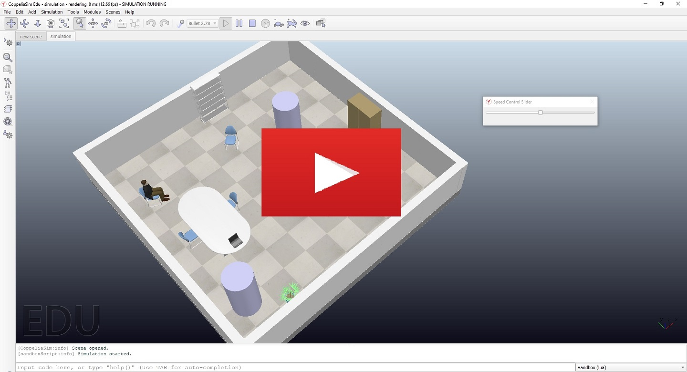

# Autonomous Search and Rescue Robot Simulation

This project, written in Lua and modeled in CoppeliaSim, demonstrates a robot capable of navigating its environment to detect and interact with obstacles and a designated target. The robot uses proximity sensors and reactive algorithms to avoid obstacles and locate the target. Additionally, a user interface for real-time speed control provides flexibility and customization during operation.

## Table of Contents
- [Features and Code Overview](#features-and-code-overview)
- [Installation](#installation)
- [Usage](#usage)
- [Video Demonstration](#video-demonstration)
- [License](#license)
- [Acknowledgments](#acknowledgments)
- [Contact](#contact)

## Features and Code Overview
This project showcases an autonomous robot equipped with real-time sensor-based navigation and control mechanisms. Key features and their corresponding technical implementations include:

- **Reactive Navigation**: The robot uses real-time sensor data to navigate and respond to obstacles by backing up when blocked and resuming forward motion when the path is clear.
- **Target Detection**: The robot identifies a specific target (referred to as the "victim") using proximity sensors. Upon detection, the robot changes the sensor color to green, signaling mission success.
- **Dynamic Speed Control**: A user-friendly interface, built with the SimUI library, allows real-time speed adjustments, offering flexibility during the simulation.
- **Visualization**: The robot's movements, obstacle interactions, and target detection are visualized through drawing objects in the simulation, making it easier to monitor the robot's behavior.

By combining these features, the robot achieves sensor-based navigation and target detection within a simulated environment, providing flexibility for experimentation and demonstration.

## Installation
1. Clone the repository to your local machine:
   ```bash
   git clone https://github.com/LoganDrdaCS/autonomous-search-rescue-robot-simulation.git
   ```
2. Ensure you have [CoppeliaSim](http://www.coppeliarobotics.com/) installed for running the simulation.
3. Place the simulation files in your CoppeliaSim directory, and open the simulation in the CoppeliaSim interface.

## Usage
- **Running the Simulation**: Launch the simulation by pressing the play button in CoppeliaSim, where the robot will begin navigating autonomously.
- **Control Speed**: Adjust the robot's speed in real-time using the custom UI slider.
- **Robot Behavior**: 
  - The robot detects obstacles and backs up / turns if blocked.
  - Once the path is clear, it resumes forward motion.
  - Upon detecting the target, the robot stops, prints the victim's coordinates, and changes the sensor color to green, indicating success. The UI is disabled at this point.

## Video Demonstration
Check out a narrated demonstration of the project on YouTube:

[](https://youtu.be/3q-JUUq5fc0)

## License
This project is licensed under the MIT License - see the [LICENSE](LICENSE) file for details.

## Acknowledgments
- CoppeliaSim for the simulation environment and the 3D model of the robot (BubbleRob)
- SimUI library for user interface creation.

## Contact
Logan Drda - logan.drda.cs@gmail.com
